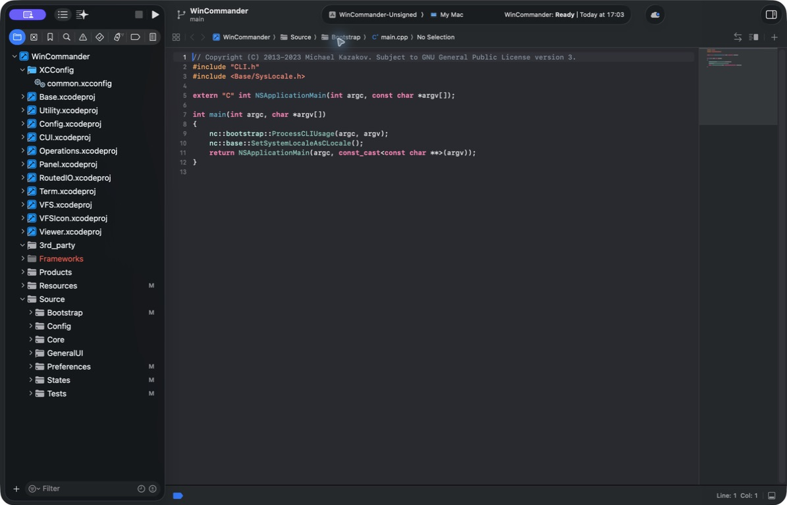

# Building Win Commander
This guide outlines the steps to build Win Commander from source. Before changing the project, read [`AGENTS.md`](../AGENTS.md), the [canonical product specification](win_commander_ideal_file_manager_spec.md), and the [development plan](Development-Plan.md).

## Getting the code
Clone this repository with `git clone`.  
To minimize internet bandwidth, you can opt to fetch only the latest version with `git clone --depth=1`.

## Compiling the Project
After obtaining the source code, you'll need Xcode 26.5 to open and compile the project. From the repository root, open the project with:

`open Source/WinCommander/WinCommander.xcodeproj`



Select the `WinCommander-Unsigned` scheme in Xcode. Use `Cmd+B` to build and `Cmd+R` to run the project under Xcode's debugger.

## Exploring the Source Code
Win Commander has a medium-sized codebase (~150KSloC) written in C++, Objective-C++ and Swift. The source tree includes the main application and 11 library projects:
  * Base: Foundational, general-purpose tools.
  * Config: Configuration management.
  * CUI: Shared UI components.
  * Operations: File operation suite built on the VFS layer.
  * Panel: File panel components.
  * RoutedIO: Admin Mode functionality, including the privileged helper and its client interface.
  * Term: Integrated terminal emulator.
  * Utility: System-specific utilities.
  * VFS: Virtual File Systems, providing a generic interface along with various implementations.
  * VFSIcon: Generates icons and thumbnails for VFS entries.
  * Viewer: Integrated file viewer component.

## Testing
Win Commander employs two testing strategies: unit tests (`_UT` suffix) for individual components, and integration tests (`_IT` suffix) for checking how those components interact. Each type of test is easily identifiable by its unique filename suffix and corresponding build target. For example, `Term` represents the library, `TermUT` the unit tests for this library, and `TermIT` the integration tests.  
Unit tests are quick and standalone, not requiring any external setups. In contrast, integration tests might need specific conditions, like running Docker VMs (detailed in `Source/VFS/tests/data/docker/[start|stop].sh`), to properly execute.  

`IntegrationTests` also builds `WinCommanderIT`, the Docker-only application boundary target. Its FTP/SFTP/WebDAV cases drive a real `PanelController` through remote navigation and forced user refresh after a mutation from a distinct shadow host. The WebDAV fault case stops and restarts only `nc_webdav_alpine`, proves a typed network failure while the committed listing remains visible, and proves a fresh listing after the same controller and host reconnect through user Refresh; it is deliberately excluded from `UnitTests` and M0.

### Physical Conditional Copy profile

`OperationsIT` contains an opt-in `[reviewed-copy-as-physical]` profile for the bounded reviewed `CopyAs` production path. It skips unless both dedicated marker roots are supplied; set `WINCOMMANDER_OPERATIONS_IT_REQUIRE_VOLUMES=1` so absent or invalid roots fail the physical job. The exact root constraints, command and required evidence are in `Docs/Features/reviewed_copy_as_physical_volume_protocol.md`. Do not use a home directory, volume mount root, user data, disk image, or a non-APFS external root for this profile.

Run the repository suites from the project root:

```sh
Scripts/verify_m0.sh
Scripts/run_all_unit_tests.sh Debug
Scripts/run_all_integration_tests.sh
```

`verify_m0.sh` and the unit-test runner require only `xcodebuild`. Integration tests additionally require a running Docker daemon and `nc`; `xcpretty` is optional, and the runner owns provider fixture startup, readiness checks, and cleanup. Record the exact commands and results in [Development-Plan.md](Development-Plan.md) when closing a milestone.

## Limitations
Unsigned local builds do not contain distribution signing identities, notarization credentials, or release secrets. Consequently, some features are restricted:
  * Privileged Helper: requires proper signing to be installed and function correctly.
  
## Implementation Notes
  * [Syntax Highlighting](SyntaxHighlighting.md)
  * [Creating Image Templates from SF Symbols](ImageTemplatesFromSFSymbols.md)
  * [Unity Builds](https://kazakov.life/2025/12/12/win-commander-and-build-times/)
