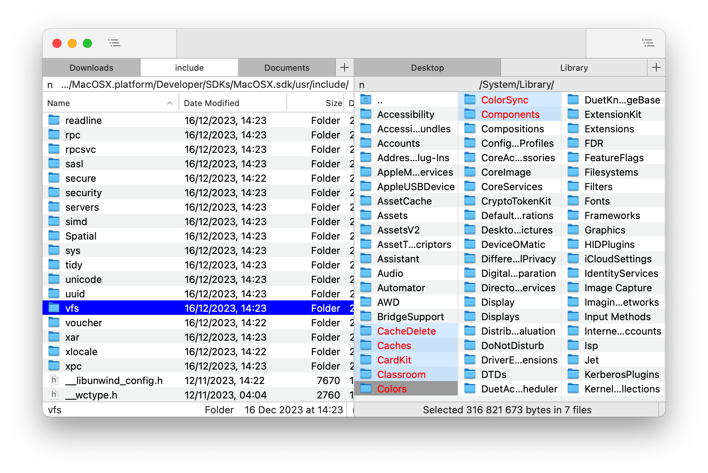

# Win Commander

Win Commander is a free dual-pane file manager for macOS, designed with a focus on speed, keyboard-based navigation, and flexibility.  
The project's aim is to blend the user experience of classic file managers from the '80s-'90s with the modern look and feel of Mac computers.  

# Documentation
The user guide can be found here: [Help.md](Docs/Help.md).

# Changelog
Details about each released version can be found in the [WHATS_NEW.md](WHATS_NEW.md) file.

# Building from Source
For build instructions and an overview of the source code, please refer to the [Building.md](Docs/Building.md) document.

# Contributing to the Project
Your contributions are welcome and greatly appreciated! For guidelines on how to contribute, including reporting bugs, suggesting features, and submitting code changes, please see the [CONTRIBUTING.md](CONTRIBUTING.md) file.

# License
Copyright (C) 2013-2026 Michael Kazakov (mike.kazakov@gmail.com)  
The source code is distributed under GNU General Public License version 3.
