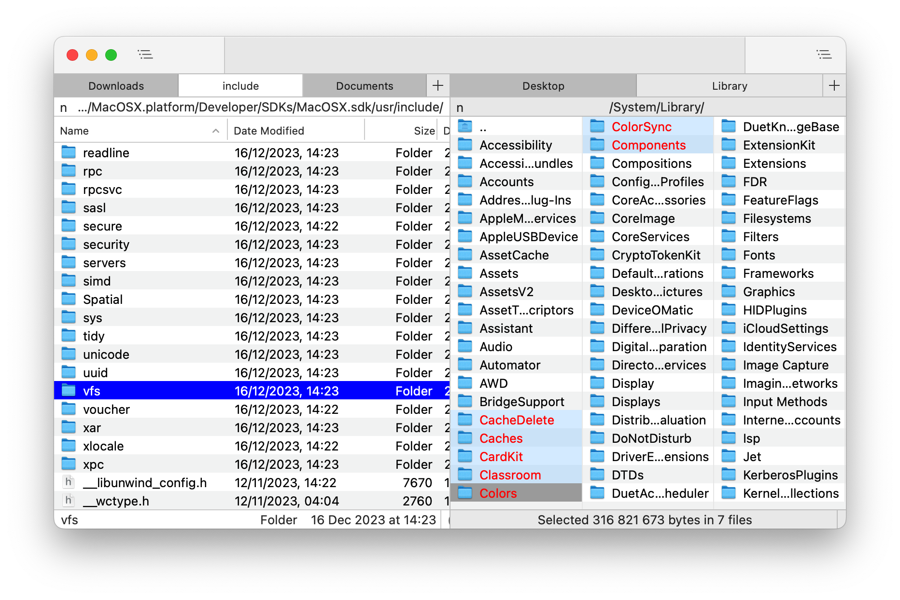

# Duck Commander



Duck Commander is a native macOS file manager built on an established upstream engine. It combines the dual-pane Commander workflow with an Explorer-style interface over the same `Panel`, `VFS`, and `Operations` foundations.

The [ideal file manager specification](Docs/win_commander_ideal_file_manager_spec.md) is the product and architecture source of truth. The [development plan](Docs/Development-Plan.md) is the active tracker for priorities, dependencies, acceptance evidence, and remaining work.

## Current status

- Commander mode is the established implementation; Explorer mode is the active migration surface.
- Navigation and refresh publish request-scoped state through `PaneStore`. Eleven stable command IDs are defined, and nine production Registry definitions now cover Copy, Cut, Rename initiation, Open, hidden files, Back, Forward, Up, and user Refresh.
- `file.open` unifies the native Open menu/selector, ordinary-file Enter fallback, Shift-Return shortcut, and context-menu exact-item route. Enter continues to route folder/archive navigation and terminal execution. Accepted Open execution is a synchronous handoff to the existing `FileOpener`; application or remote-provider completion remains outside that Registry result.
- The safe-operation foundation includes immutable planning, bound VFS evidence, private-sealed single-use review authority, deterministic schema-v1 serialization, durable journaling, provider-minted conditional transactions, typed publication outcomes, and hardened `Job`/`Operation`/`Pool` lifecycle.
- `CopyOperationOrchestrator` now has a production constructor over the journal, `Pool`, and run-receipt custodian. It reaches the private `ReviewedOperationFactory` path, which returns a sealed move-only provider execution product; injected construction remains a test-only seam. Restricted lifecycle and item-status hooks are installed while the operation is cold, and an owning exact durable outcome is delivered at most once after finalization or reconciliation. `Pool` preallocates terminal-transition authority before start; failed, cancelled, and interrupted outcomes use `ReleaseWithoutCompletion` so removal and pending-work progress remain independent from generic success reporting. Pre-enqueue persistence failure retains exact retry authority. Post-rename uncertainty requires storage-bound journal reopen, read-only reconciliation, and an explicit `ReleaseReconciled` handshake with the exact `Pool` residency.
- `CopyAs::Perform` is the first bounded production consumer. One regular Native item copied create-only within its source directory enters the reviewed path only when path-specific eligibility is explicitly `Supported`. The app shows the exact bound-plan summary, rechecks pane and focused-item identity before approval and submission, uses a process-owned journal/custodian/recovery coordinator and the window `Pool`, and maps item status plus owning durable outcomes back to the UI. Known unsupported shapes retain the established operation; unavailable eligibility and every failure after reviewed selection fail closed.

The first Native conditional provider scope is implemented for one create-only regular file on the exact same internal, local, writable APFS volume. Its path-aware support probe and transaction share the same conservative volume policy. The transaction consumes typed reviewed authority, anchors source and destination-parent descriptors, seals and revalidates supported ownership, mode, timestamps, flags, ACLs and extended attributes, publishes exclusively through `fclonefileat(..., CLONE_ACL)`, verifies the destination, and orders destination, parent, and full-filesystem durability barriers. Published metadata and filesystem-sync failures remain explicit typed outcomes. Cross-volume Copy still requires provider-owned bounded staging; broader mutations remain on the established operations.

## Build and verify

Open `Source/WinCommander/WinCommander.xcodeproj` and use the `WinCommander-Unsigned` scheme for editing and compile-only development. Interactive runs use the stable locally signed development app so the same macOS TCC identity is preserved across rebuilds.

```sh
Scripts/verify_m0.sh
Scripts/build_stable_dev_and_run.sh
Scripts/verify_stable_dev_identity.sh
Scripts/run_all_unit_tests.sh Debug
Scripts/run_all_integration_tests.sh
```

The local-development entry point installs and opens `~/Applications/WinCommander-Codex.app` with the fixed bundle ID `com.wincommander.App.CodexDev` and machine-pinned certificate plus exact designated requirement. Rebuilds replace that exact channel only after its identity and entitlement profile are proven unchanged. `Scripts/build_unsigned_and_run.sh` remains a compatibility alias and delegates to the same stable path.

Current local evidence:

- current focused Debug journal, provider-result mapper, execution product, reviewed factory, Job, Copy orchestrator, and Pool: 27 / 592, 4 / 237, 9 / 188, 8 / 225, 10 / 608, 15 / 758, and 17 / 219; the production-orchestrator subset is 3 / 138;
- current full Debug `WinCommanderUT`: 309 / 4,995; reviewed `CopyAs` policy and submission-gate selection pass 6 / 28, and recovery coordination passes 6 / 67;
- latest full Debug `VFSUT` run: 95 / 43,566;
- current full `OperationsUT`: 170 / 4,748 in Debug, explicitly instrumented Release ASAN, and explicitly instrumented Release UBSAN; both sanitizer runtimes were confirmed and emitted no diagnostics;
- current ProviderCapabilities and Native conditional Copy: 16 / 549 and 16 / 328 in Debug; combined Debug selection 32 / 877;
- current-tree M0 gate: 897 / 132,011 across all ten aggregate unit-test binaries;
- seeded ASAN integration total: 163 / 89,392.

Focused `file.open` evidence is 24 cases / 267 assertions: command eligibility and execution 8 / 102, Registry and legacy shortcut binding 15 / 99, and production menu/Enter/context-menu/Shift-Return routing 1 / 66. The complete production Registry fixture passes 3 / 122; explicit Release ASAN passes the core command and production route filters at 9 / 168. The first hosted CI run remains pending.

See [Building.md](Docs/Building.md) and [Scripts/README.md](Scripts/README.md) for prerequisites, signing limits, schemes, and integration fixtures.

## Documentation

- [Canonical specification](Docs/win_commander_ideal_file_manager_spec.md)
- [Active development plan](Docs/Development-Plan.md)
- [Architecture audit](Docs/current_architecture_audit.md), [ADR 0001](Docs/ADR/0001-native-conditional-copy-publication.md), [refactor plan](Docs/refactor_plan.md), [gap matrix](Docs/feature_gap_matrix.md), and [risk register](Docs/implementation_risks.md)
- Command slices: [`file.open`](Docs/Features/file_open_command_registry_slice.md), [`file.rename`](Docs/Features/file_rename_command_registry_slice.md), [`view.toggleHiddenFiles`](Docs/Features/view_toggle_hidden_files_command_registry_slice.md), [navigation history](Docs/Features/navigation_history_command_registry_slice.md), and [Up/Refresh](Docs/Features/pane_navigation_up_refresh_command_registry.md)
- Operation foundations: [plan](Docs/Features/operation_plan_foundation.md), [Copy preflight](Docs/Features/copy_preflight_planner_foundation.md), [VFS evidence](Docs/Features/vfs_operation_planning_probes_foundation.md), [review/factory](Docs/Features/reviewed_copy_factory_foundation.md), [codec](Docs/Features/operation_plan_codec_foundation.md), [native execution](Docs/Features/native_create_copy_execution_foundation.md), [journal](Docs/Features/operation_journal_foundation.md), [conditional execution product](Docs/Features/provider_conditional_copy_execution_product.md), [Copy orchestrator](Docs/Features/copy_operation_orchestrator_foundation.md), [submission hooks](Docs/Features/copy_operation_submission_hooks.md), and the [bounded production `CopyAs` consumer](Docs/Features/reviewed_copy_as_production_consumer.md)
- [Changelog](changelog.md), [user guide](Docs/Help.md), and [contribution guide](CONTRIBUTING.md)

## Origin and license

Duck Commander derives from Michael Kazakov's [upstream file-manager project](https://github.com/mikekazakov/nimble-commander). Upstream copyright notices remain in the source. The project is licensed under [GPLv3](LICENSE.md).
